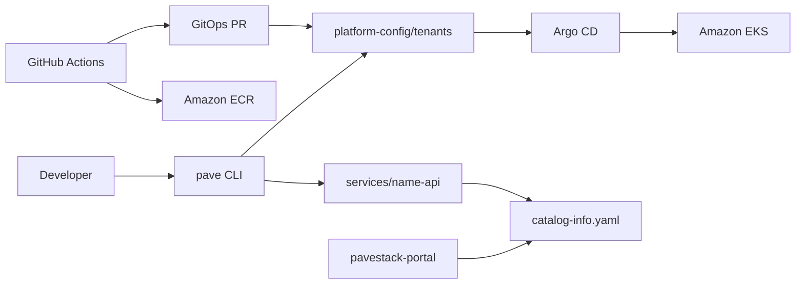

# Pavestack

Pavestack is an Internal Developer Platform (IDP) MVP delivered as a monorepo. Platform teams operate shared infrastructure; product teams scaffold services via the golden path and deploy through GitOps.

## Repository layout

| Directory | Role |
|-----------|------|
| [`platform-infra/`](platform-infra/) | Terraform modules (VPC, EKS, ECR, GitHub OIDC, Argo CD bootstrap) |
| [`platform-config/`](platform-config/) | GitOps manifests reconciled by Argo CD |
| [`service-template-api/`](service-template-api/) | Golden-path Go API scaffold |
| [`pave/`](pave/) | Self-service CLI (`pave create-service`) |
| [`pavestack-portal/`](pavestack-portal/) | Read-only catalog and scorecards |
| [`services/`](services/) | Generated internal API services |

## Architecture



## Delivery model (GitOps)

1. **CI builds artifacts** — tests, security scans (Checkov, Trivy, Gitleaks, TFLint), container images pushed to ECR.
2. **CI opens PRs** — image tags and scaffold changes land in `platform-config`.
3. **Argo CD reconciles** — cluster state follows git; no `kubectl apply` from developer laptops.

## Prerequisites

| Tool | Version | Purpose |
|------|---------|---------|
| Go | >= 1.23 | Build pave CLI and service-template-api |
| Node.js | >= 20 | Build pavestack-portal |
| Terraform | >= 1.6 | Manage platform-infra |
| Docker | >= 24 | Build container images |
| `gh` (GitHub CLI) | >= 2 | Automated PR creation (optional) |
| AWS CLI | >= 2 | Cloud operations (optional for dev) |

## Quick start

### Platform infrastructure

```bash
# 1. Bootstrap remote state
cd platform-infra/bootstrap/remote-state && terraform init && terraform apply

# 2. Deploy dev environment
cd platform-infra/envs/dev
cp backend.hcl.example backend.hcl   # S3 backend with use_lockfile = true
terraform init -backend-config=backend.hcl
terraform apply
```

Register the root Application manually once per cluster:

```bash
kubectl apply -f platform-config/clusters/dev/root-application.yaml
```

### Scaffold a service

```bash
make pave
./bin/pave create-service --name payments --team team-payments --database=false
```

This copies `service-template-api` → `services/payments-api` and writes `platform-config/tenants/payments/`.

### Run tests

```bash
make test
```

### Developer portal

```bash
make build-portal
# static site in pavestack-portal/out/
```

## Security defaults

- Distroless/non-root containers
- Default-deny tenant NetworkPolicies
- GitHub OIDC for CI (no long-lived AWS keys in repos)
- Terraform remote state in S3 with native lockfiles (`use_lockfile = true`, no DynamoDB)
- Structured logging and OpenTelemetry hooks in services
- KMS encryption for EKS secrets and S3 state
- Immutable ECR image tags with scan-on-push

## CI workflows

| Workflow | Component | Scanners |
|----------|-----------|----------|
| `.github/workflows/platform-infra.yml` | Terraform | Checkov, Trivy, TFLint, Gitleaks |
| `.github/workflows/platform-config.yml` | GitOps manifests | Checkov, Trivy, Gitleaks |
| `.github/workflows/service-template-api.yml` | API template | Checkov, Trivy, Gitleaks |
| `.github/workflows/pave-cli.yml` | pave CLI | Checkov, Trivy, Gitleaks |
| `.github/workflows/pavestack-portal.yml` | Portal | Checkov, Trivy, Gitleaks |
| `.github/workflows/monorepo-security.yml` | Repository-wide guardrails | Checkov, Trivy, TFLint, Gitleaks |

## Environment outputs

Terraform environments expose: `cluster_name`, `cluster_endpoint`, `vpc_id`, `private_subnet_ids`, `public_subnet_ids`, `subnet_ids`, `ecr_repository_urls`.

## Contributing

1. Fork the repository and create a feature branch
2. Make changes following existing patterns — all code must be production-aligned
3. Run `make test` and `make lint` before opening a PR
4. Ensure CI passes: security scans (Checkov, Trivy, Gitleaks, TFLint) must be green
5. Follow the GitOps constraint: CI builds artifacts and opens PRs; never run `kubectl apply` directly
