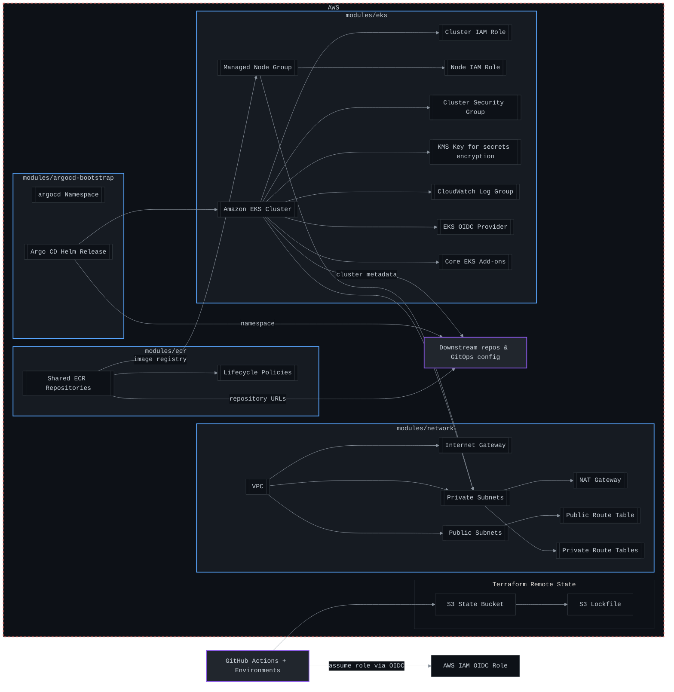

# platform-infra

Terraform foundation for Pavestack, a CLI-first internal developer platform MVP.

This repository owns shared AWS infrastructure and Kubernetes bootstrap only. It intentionally does not own application workloads, service manifests, or namespaced delivery state. Argo CD reconciles in-cluster desired state from a separate GitOps config repository.

## What This Repo Owns

- AWS network foundation: VPC, public/private subnets, routing, NAT, and EKS subnet tags.
- IAM for platform bootstrap: EKS roles, node roles, add-on roles, and optional GitHub Actions OIDC roles.
- EKS baseline: managed control plane, managed node group, core add-ons, log groups, and encryption key.
- Image registry strategy: shared ECR repositories for platform-managed base images and tooling.
- Cluster bootstrap: Argo CD installed by Helm into `argocd`.
- Outputs consumed by downstream repos: cluster name, endpoint, OIDC issuer, subnet IDs, VPC ID, ECR URLs, and Argo CD namespace.

## What This Repo Does Not Own

- Application workloads or Kubernetes manifests for services.
- Namespaces, Deployments, Services, Ingresses, Secrets, or app-specific RBAC.
- Argo CD `Application` resources for services.
- Portal UI, scorecards, or a full observability platform.
- Plaintext secrets.

## Architecture Overview



## Repository Layout

```text
.
├── bootstrap/remote-state      # One-time S3 state bucket and lockfile state setup
├── envs/dev                    # Dev environment composition
├── envs/prod                   # Prod environment composition
├── modules/argocd-bootstrap    # Helm bootstrap for Argo CD only
├── modules/ecr                 # Shared image registries
├── modules/eks                 # EKS baseline, IAM, add-ons
├── modules/github-oidc         # Optional CI role trust for GitHub Actions
├── modules/network             # VPC, subnets, routing
├── scripts/terraform-env.sh    # Small local Terraform helper
└── .github/workflows           # fmt, validate, scan, plan, apply
```

## Prerequisites

- Terraform `>= 1.9.0`.
- AWS CLI access for the target account.
- An AWS region with EKS support.
- A pre-created or bootstrapped remote state backend.
- GitHub environments named `dev` and `prod` for controlled applies.

## Remote State

Create remote state once per AWS account:

```bash
cd bootstrap/remote-state
terraform init
terraform apply \
  -var='name_prefix=pavestack' \
  -var='environment=shared' \
  -var='aws_region=eu-central-1'
```

Terraform now natively supports S3-native state locking via `use_lockfile = true`. DynamoDB is no longer used or required for this project.

Copy each environment backend example and fill in the bucket and region:

```bash
cp envs/dev/backend.hcl.example envs/dev/backend.hcl
cp envs/prod/backend.hcl.example envs/prod/backend.hcl
```

Then initialize:

```bash
terraform -chdir=envs/dev init -backend-config=backend.hcl
```

## Local Workflow

```bash
make fmt
make init ENV=dev
make validate ENV=dev
make plan ENV=dev
make apply ENV=dev
```

Production follows the same commands with `ENV=prod`.

## CI/CD Workflow

- Pull requests run `terraform fmt`, `terraform validate`, Checkov scanning, and `terraform plan`.
- Pull requests also run Infracost (`infracost` job, gated on the
  `INFRACOST_API_KEY` secret being set) and post the estimated monthly cost
  delta as a PR comment — FinOps visibility at review time, before anything
  applies. Infracost prices from HCL directly and needs no AWS credentials.
- Applies run only from `main` or manual dispatch.
- GitHub environment protection should require approval for `prod`.
- GitHub Actions uses AWS OIDC; no long-lived AWS keys are required.

## Azure (multi-cloud)

Pavestack is moving to multi-cloud, with Azure as the next target. The Azure path
mirrors the AWS one resource-for-resource:

| AWS | Azure |
|-----|-------|
| `modules/vpc` (VPC, subnets, NAT) | `modules/azure/network` (VNet, subnet, NAT gateway) |
| `modules/eks` (EKS + KMS + OIDC) | `modules/azure/aks` (AKS, workload identity, Log Analytics) |
| `modules/ecr` | `modules/azure/acr` (Premium ACR) |
| `modules/github-oidc` (IAM role) | `modules/azure/github-oidc` (user-assigned identity + federated credential) |
| `modules/argocd-bootstrap` | reused as-is (cloud-agnostic Helm) |
| `bootstrap/remote-state` (S3) | `bootstrap/azure-remote-state` (Storage Account + container) |
| `envs/{dev,prod}` | `envs/azure/{dev,prod}` |

AKS relies on Azure's default platform-managed etcd encryption at rest (the parallel
to the EKS module's explicit KMS key); customer-managed Key Vault encryption can be
layered on later.

### Deployment is disabled by default

**Nothing deploys until the corresponding variables are set:**

- AWS deploy jobs run only when `vars.AWS_ROLE_ARN` is set **and**
  `vars.ENABLE_AWS_DEPLOY == 'true'`. AWS is disabled for now, so leaving
  `ENABLE_AWS_DEPLOY` unset keeps AWS `plan`/`apply` and the ECR `build-push-pr` job
  skipped even if a role ARN is present.
- Azure deploy jobs (`platform-infra-azure.yml` and the `build-push-acr` job) run only
  when `vars.AZURE_CLIENT_ID` is set (credentials-unset gate).

With none of these configured, only `fmt`/`validate`/scan run and the pipeline is
green. To re-enable AWS later, set `ENABLE_AWS_DEPLOY=true` (with a valid
`AWS_ROLE_ARN`). To enable Azure applies later, create GitHub repository/environment
variables:

| Variable | Purpose |
|----------|---------|
| `AZURE_CLIENT_ID` | Federated identity client ID (also the deploy gate) |
| `AZURE_TENANT_ID` | Entra ID tenant ID |
| `AZURE_SUBSCRIPTION_ID` | Target subscription |
| `TF_AZURE_BACKEND_RESOURCE_GROUP` | Resource group holding the state storage account |
| `TF_AZURE_BACKEND_STORAGE_ACCOUNT` | State storage account name |
| `TF_AZURE_BACKEND_CONTAINER` | State blob container name |
| `ACR_REGISTRY` | Container registry short name for image pushes |

GitHub Actions authenticates to Azure with OIDC federated credentials (no client
secrets). Bootstrap the state backend once with `bootstrap/azure-remote-state`, then
`terraform -chdir=envs/azure/dev init -backend-config=backend.hcl`.

## Cost-tagging convention

Every resource is tagged via a single `local.tags` map per environment
(`envs/{dev,prod}/main.tf`, `bootstrap/remote-state/main.tf`), merged into
each module's resources: `Project`, `Repository`, `Environment`,
`ManagedBy`, `CostCenter` (`var.cost_center`, default
`platform-engineering`), and `Team` (`var.team`, default `platform`). The
`Team` tag value intentionally matches the `pavestack.io/team` Kubernetes
label a tenant namespace/workload carries (see
`platform-config/templates/namespace` and
`platform-config/policies/kyverno/require-labels.yaml`), so AWS Cost
Explorer cost-allocation-tag reports and in-cluster cost attribution use
the same team slug instead of two parallel, drifting taxonomies.

## Downstream Outputs

Downstream repos should consume stable outputs instead of inferring resource names:

- `cluster_name`
- `cluster_endpoint`
- `cluster_oidc_issuer_url`
- `vpc_id`
- `private_subnet_ids`
- `public_subnet_ids`
- `ecr_repository_urls`
- `argocd_namespace`

## GitOps Boundary

This repo installs Argo CD, but does not configure service applications. A separate GitOps config repo should define:

- environment namespaces
- Argo CD projects and applications
- app deployments
- service ingress/routing manifests
- app-specific config and sealed/external secret references

Argo CD best practice is to keep application configuration in a separate Git repository from application source code, which gives cleaner separation, simpler auditing, and better control over who can change runtime state.

## Safety Notes

- Do not commit `terraform.tfvars`, backend files, state files, or plan files.
- Keep AWS IAM role trust scoped to repository and protected environments.
- Review plans before apply.
- Prefer adding outputs over reaching into module internals from downstream repos.
- Keep this repo free of service-specific Kubernetes resources.